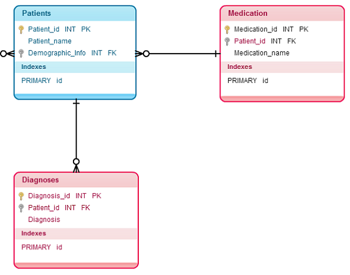
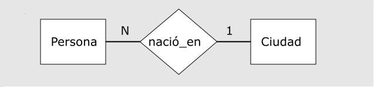

<!-- $theme: gaia -->
<!-- $size: 16:9 -->

# ==Base de datos== para tu proyecto

- ¿Qué es una base de datos?
- Componentes de una BD
- Entidad como una tabla
- Porqué usar una base de datos en tu proyecto
- Base de datos por sobre hojas de calculo
- Modelamiento de una BD básica
	- Modelo entindad Relación
	- Modelo relacional
- Ejemplo de subconsulta

---
<!-- *template: invert -->
# ¿Qué es una base de datos?

Es una herramienta para recopilar y organizar grandes cantidades de información de manera estructurada y con la menor redundancia posible.

	

---
# Componentes de una ==Base de datos==

- **Entidades** Son objetos o "cosas"
- **Atributos** Le dan propiedades a la entidad
- **Relaciones** Establecen la relación entre dos entidades

---

# Entidad como tabla

 

#### Entidad ratón

Nombre raton  | Peso | Raza | Color
----- | ------ | ------- | -------
Alfajor | 0.5 kg |  Mus musculus |  Blanco
 Tomas | 1.5 kg |  Cricetinae |  Gris 
 
 

 
 
---

# Porqué usar una base de datos en tu proyecto
  
- Evita la **redundancia** de datos
- Permite hacer consultas complejas para el **análisis del contenido**
- Permite establecer reglas a la hora de **trabajar en equipo**

---

## Ejemplo de tabla única con redundancia

Nombre Paciente| Tipo | Síntomas | Medico | Rut | E.C. | Sueldo
-------------- | ---- | ------ | ----- | ----| ------| --------
Sasha | Felino | Vomito, cansancio | Álvaro Pérez | 16.336.789-7 | Soltero | $500.000
Luna | Felino | Un poco vaga | Álvaro Pérez | 16.336.789-7 | Soltero | $500.000
Toby | Canino | No come | Juan Piedra | 15.533.559-5 | Soltero | $700.000

---

##  Ejemplo con más de una tabla sin redundancia

##### Entidad Paciente
Nombre Paciente| Tipo | Síntomas | Medico
-------------- | ---- | ------ | -------
Sasha | Felino | Vomito, cansancio | Álvaro Pérez
Luna | Felino | Un poco vaga | Álvaro Pérez
Toby | Canino | No come | Juan Piedra
 

##### Entidad Medico

Medico | Rut | E.C. | Sueldo
---- | ------ | -------- | -------
Álvaro Pérez | 16.336.789-7 | Soltero | $500.000
Juan Piedra | 15.533.559-5 | Soltero | $700.000

---
## Base de datos por sobre hojas de calculo

 

---
# Inplementación

---

https://www.lluiscodina.com/como-disenar-una-base-de-datos-para-nuestro-proyecto-de-investigacion/

https://www.gcfaprendelibre.org/tecnologia/curso/access_2010/trabajar_con_bases_de_datos/1.do

http://es.schoolofdata.org/2013/11/27/sql-la-precuela-excel-vs-bases-de-datos/

---