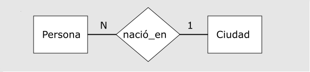

# Base de dato para tu proyecto científico

## Qué es una BD

Es una herramienta para recopilar y organizar grandes cantidades de información de manera estructurada y con la menor redundancia posible. Esto nos permite acceder a información que necesitamos de manera rápida y cómoda.

Es una buena opción  cuando se debe  registrar y modificar datos con regularidad y después obtener subconjuntos de estos datos.

	

## Componentes de una Base de datos

Una BD esta compuesta principalmente por entidades que es la representación de un objeto y esta tiene atributos las cuales dan propiedades a ese objeto.

Las entidades no están solas, se relacionan entre ellas a través de relaciones, que se encargan de **esclarecer** el vinculo entre dos o más entidades.

Las relaciones por lo general tienen a desaparecer en la implementación de una BD.

## Entidad como una tabla

Un entidad puede ser representada como una tabla, en donde sus atributos son sus columnas, la ocurrencia de la entidad son sus filas.

Rut | Nombre | Ocupación | Peso
--- | ------ | --------- | -------
15.654.896-6  |   Juan     |  Trabajador | 70
23.459.786-1 |    Maria   |     Estudiante | 60

## Porqué usar una base de datos en tu proyecto

- Una base de datos te va a evitar la **redundancia** generada al mezclar todos los datos que tengas en una sola hoja de calculo.

- **Búsquedas complejas** Una base de datos te va a permitir hacer consultas entre varias tablas distintas permitiendo obtener la información que requieres para el análisis del contenido.

- **Trabajo en equipo** Permite a establecer reglas a la hora de actualizar los datos, evitando que se produzcan inconsistencias entre los nuevos y los viejos datos.

Se usa cuando se debe manejar datos que no se pueden manejar de manera eficaz en una sola tabla, por ejemplo, si se desea almacenar los datos de una consulta veterinaria, es mejor tener tablas separada con los datos de los médicos y de animales que atiende, debido a que si desea ver los síntomas en los que llego un animal la primera vez que llego no va a interesar que ver la dirección y el estado civil del medico que lo atendió.

- Ejemplo de tabla única

Nombre Paciente| Tipo | Síntomas | Medico | Rut | E.C. | Sueldo
-------------- | ---- | ------ | ----- | ----| ------| --------
Sasha | Felino | Vomito, cansancio, pelo caído | Álvaro Pérez | 16.336.789-7 | Soltero | $500.000
Luna | Felino | Un poco vaga | Álvaro Pérez | 16.336.789-7 | Soltero | $500.000
Toby | Canino | No come | Juan Piedra | 15.533.559-5 | Soltero | $700.000

- Ejemplo con más de una tabla

Nombre Paciente| Tipo | Síntomas | Medico
-------------- | ---- | ------ | -------
Sasha | Felino | Vomito, cansancio, pelo caído | Álvaro Pérez
Luna | Felino | Un poco vaga | Álvaro Pérez
Toby | Canino | No come | Juan Piedra

Medico | Rut | E.C. | Sueldo
---- | ------ | -------- | -------
Álvaro Pérez | 16.336.789-7 | Soltero | $500.000
Juan Piedra | 15.533.559-5 | Soltero | $700.000

Como se puede apreciar, cuando se usa más de una tabla se pudo obtener los datos que realmente se necesitan en el instante y además como las dos tablas tienen el mismo campo (Medico) entonces es posible establecer una relación entre ambas tablas (poder hacer búsquedas cruzadas).

## Base de datos por sobre una hoja de calculo.

Debido a su facilidad la gente tiende a usar hojas de calculo al inicio de un proyecto, pero estas se vuelven ineficiente a medida que se van agregando más y más datos.

Esto se debe a que las hojas de calculo no están hecha para administrar grandes cantidades de datos, sino para el cálculo y el análisis de los datos.

Aun así ambas herramientas no son excluyentes sino que son complementarias, tanto libreoffice base como access le permiten búsquedas cruzadas entre tablas de la base de datos y el resultado llevarlo a una hoja de calculo en el que pueda analizar los datos con las herramientas de esta.

## Modelamiento

Un equipo de investigación esta estudiando el comportamiento de una población de huarenes
