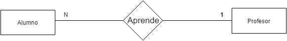
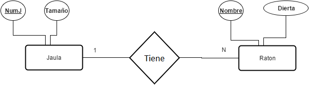

# Base de datos para tu proyecto científico

El objetivo de esta charla es mostrar los elementos escenciales para modelar una base de datos básica que permita almacenar los datos de un proyecto sin entorpecer al proyecto mismo a la hora de analizar lor datos. Se explica como crear el diseño conceptual usando el modelo entidad relación y se muestra como obtener las tablas a implementar a partir del modelo relacional, aunque sin explicar este directamente.

Además se agrega material de ayuda para implementarla en un sistema de gestión de base de datos y se da un ejemplo de una BD relacional implementada en LibreOffice Base.

## Qué es una base de datos

Es una herramienta que nos permite recopilar y almacenar grandes cantidades de información de manera estructurada y con la menor redundancia posible

Es una buena opción  cuando se debe  registrar y modificar datos con regularidad y después obtener subconjuntos de estos datos.

## Base de datos dentro de un proyecto científico

Al tener que empezar a guardar los datos de una investigación es normal empezar usando una hoja de calculo, pero a medida que se vayan aumentando los datos de una investigación uno se va a entrar en la necesidad de tener que crear tablas más pequeñas con información más precisa respecto a un solo objeto en vez de tener una sola tabla grande con todas propiedades de varios objetos juntos.

A la vez, se va a requerir que la información entre esas tablas más pequeñas se pueda mezclar y mostrar de distintas formas para poder analizar el contenido. Dicho de otra forma, se va a requerir poder hacer búsquedas cruzadas entre tablas.

Y si se trabaja en equipo se va a  establecer reglas a la hora de actualizar los datos, evitando que se produzcan inconsistencias entre los nuevos y los viejos datos. Por ejemplo, que en una columna con números de teléfono solo se puedan ingresar números y no caracteres.

En sí, por lo general usaremos bases de datos cuando se debe manejar datos que no se pueden manejar de manera eficaz en una sola tabla, por ejemplo, si se desea almacenar los datos de una consulta veterinaria, es mejor tener tablas separada con los datos de los médicos y de animales que atiende, debido a que si desea ver los síntomas en los que llego un animal la primera vez que llego no va a interesar que ver la dirección y el estado civil del medico que lo atendió.

- Ejemplo de tabla única

Nombre Paciente| Tipo | Síntomas | Medico | Rut | E.C. | Sueldo
-------------- | ---- | ------ | ----- | ----| ------| --------
Sasha | Felino | Vomito, cansancio, pelo caído | Álvaro Pérez | 16.336.789-7 | Soltero | $500.000
Luna | Felino | Un poco vaga | Álvaro Pérez | 16.336.789-7 | Soltero | $500.000
Toby | Canino | No come | Juan Piedra | 15.533.559-5 | Soltero | $700.000

- Ejemplo con más de una tabla

Nombre Paciente| Tipo | Síntomas | Medico
-------------- | ---- | ------ | -------
Sasha | Felino | Vomito, cansancio, pelo caído | Álvaro Pérez
Luna | Felino | Un poco vaga | Álvaro Pérez
Toby | Canino | No come | Juan Piedra

Medico | Rut | E.C. | Sueldo
---- | ------ | -------- | -------
Álvaro Pérez | 16.336.789-7 | Soltero | $500.000
Juan Piedra | 15.533.559-5 | Soltero | $700.000

### Conceptos importantes a la hora de modelar

Una BD esta compuesta principalmente por **entidades** que es la representación de un objeto y esta tiene atributos las cuales dan propiedades a ese objeto.

Además cuando un atributo especial sirve para distinguir una instancia de otra en una entidad se le llama **identificador**. Es único para cada instancia, por lo que no se puede repetir su valor, también se les llama clave primaria

Las entidades no están solas, se conectan entre ellas a través de **relaciones**, que se encargan de esclarecer el vinculo entre dos o más entidades.

Las relaciones por lo general tienen a desaparecer en la implementación de una BD.

### Entidad como una tabla

Un entidad puede ser representada como una tabla, en donde sus atributos son sus columnas, la ocurrencia de la entidad son sus filas.

Rut | Nombre | Ocupación | Peso
--- | ------ | --------- | -------
15.654.896-6  |   Juan     |  Trabajador | 70
23.459.786-1 |    Maria   |     Estudiante | 60

La entidad es Persona, sus atributos Rut, nombre, Ocupación y Peso.  
El identificador de la entidad es el rut ya que es único.  
Juan y María son instancias de la entidad Persona. 

## El modelo Entidad relación

Es un método que nos permite diseñar nuestra base de datos, nos va a permitir representar una abstracción en un diagrama que sea fácilmente legible y entendible para cualquiera que lo vea.

### Comenzando a crear el modelo entidad-relación

### Problema inicial

Un equipo de investigación desea estudiar los medicamentos que los doctores les dan a sus pacientes. Para ello deciden crear una base de datos, hasta ahora estos son los datos que desean almacenar.

 - Para cada paciente se desea almacenar su rut, nombre y su diagnostico.

- Para cada medicamento guardar su Identificador único, nombre y componente activo.

- Para cada doctor, registrar su rut, nombre y área en la que se desempeña.

Tomar en cuenta que cada paciente tiene un solo medico y un paciente puede tomar varios medicamentos a la vez, por lo que se debe guardar también la cantidad medicamentos toma cada paciente.

#### Paso 1  detectar las entidades

En el modelo entidad relación  la entidades de representan a través de un rectángulo.

En el caso del problema podemos afirmar que las entidades son paciente medicamento y doctor, ya que son objetos que tienen atributos propios.

#### Detectar las relaciones

En el MER las relaciones entre entidades se representan con un rombo.

En el problema se relacionan las entidades Paciente con medicamente, y Paciente con doctor. por lo que establecen las relaciones entre ellos.

#### Identificar los atributos de las entidades

Los atributos son las propiedades de las entidades, se representan con una circunferencia.

En este caso paciente tiene un rut, nombre y un diagnostico.

Doctor tiene un Rut, nombre y una especialización.

Cada medicamento tiene un Identificador único, nombre y un componente activo.

Nótese que el rut de paciente se identifica con rutP y el del doctor con RutP para poder diferenciarlos en una futura búsqueda cruzada luego de su implementación.

### Identificar los atributos de las relaciones

Las relaciones también pueden llevar atributos, esto es debido a que muchos pacientes pueden tomar muchos medicamentos, por lo que la cantidad a tomar de cada medicamento no es atributo propio de ninguna entidad, pero si de la relación entre estas.

### Establecer los identificadores de las entidades

Los identificares se representan con subrayado en el nombre del identificador.

El identificador es el atributo que es único y no se repite. A partir a ahora se le llamara al identificador clave primaria.

En el caso de que no haya un identificador único entonces de pueden seleccionar uno o más atributos para ser la clave primaria de la entidad.

En el MER los atributos en las relaciones no tiene identificadores.

### El concepto de cardinalidad

Se refiere a la forma en que se relacionan las entidades, más que nada a la cantidad de instancias de una entidad que le corresponden a otra entidad.
Este concepto es importante ya que es el eje principal de las búsquedas cruzadas en las tablas.

Existen tres tipos de cardinalidades distintas o formas en la que se relación las entidades.

 - **Relación 1:1** (uno a uno) Cuando a un elemento de una entidad le corresponde un único elemento de la otra entidad.  
En el ejemplo un periodista va a escribir una columna en el diario.

 - **Relación 1:N** (uno a muchos) Cuando a un elemento de una entidad le corresponden muchos elementos de la otra entidad.  
 En el ejemplo a un alumno se le asigna un solo profesor pero a un profesor se le asignan varios alumnos.

- **Relación N:M** (Mucho a muchos) Cuando a muchos elementos de una sola entidad le corresponden varios elementos de la otra entidad.  

 En el ejemplo un camionero conduce varios camiones, y un camión puede ser conducido por varios camioneros.

 

### Modelo final

## Modelo relacional

Una vez terminado el modelo entidad relacional se tiene hecho la mitad del modelamiento, esto es debido el modelo entidad relación solo sirve para representar una idea. Para poder implementarla en un sistema de gestión de base de datos se requiere llevar el modelo entidad relación a un modelo relacional, este modelo nos va a dar una base algebraica en la que cada entidad se va a poder ver como un conjunto dentro de la cuál se puede hacen   operaciones de unión, intersección, resta, selección, etc.  
A esta álgebra se le llama algebra relacional y el lenguaje con el que se implementa se le llama SQL.

### Transformar de MED a MR

Al pasar del MER a Modelo relacional se deben eliminar las relaciones entre tablas, pero aun así debe quedar claro como se relacionan ambas tablas. Para lograr esto es que se debe agregar un nuevo atributo a las entidades, este atributo es la clave foránea.

Una clave foránea no es nada más que la clave primaria de una tabla dentro de otra tabla con la que se relaciona.

Para propósitos de la charla se trabajara con las tablas que se obtienen del modelo relacional en vez del mismo modelo en sí, esto para ver de manera didáctica como interactúan y se relacionan las tablas.

Se siguen las siguientes reglas.

- __Si la relación es 1:1__ Entonces la clave primaria de una tabla pasa como clave foránea a otra tabla.

- __Si la relación es 1:N__ Entonces clave primaria de una tabla pasa como clave foránea de la entidad con N.

 - __Si la relación es N:M__ La relación de las dos entidades se convierte en una tabla y tiene como clave primaria las dos claves primarias de las tablas que relaciona.

En el ejemplo, las tablas que se obtienen de pasar el de Modelo entidad relación a modelo relacional es:

### Vista desde el Modelo relacional

# Conclusión

Las base de datos nos una gran ventaja a la hora de hacer proyectos de investigación, permitiendo almacenar información de manera estructurada y poder ver información nueva a través de la que tiene.

Como contraparte, se quiere una curva de aprendizaje modelar e implementar una base de datos, pero con lo visto en la charla, se puede modelar, que por más básica que una la vea, nos va a permitir almacenar toda la información que recolectemos sin entorpecer la investigación.

# Material De ayuda

#### Base de datos en proyectos de investigación

https://www.lluiscodina.com/como-disenar-una-base-de-datos-para-nuestro-proyecto-de-investigacion/

#### Sobre el modelo entidad relación

http://www.genbetadev.com/bases-de-datos/fundamento-de-las-bases-de-datos-modelo-entidad-relacion

#### Transformar de modelo entidad relación a Modelo relacional (explicado de MER a tablas)

http://www.esferatic.com/2012/05/bases-de-datos-iii-diseno-logico/

#### Implementando una BD en access

https://www.gcfaprendelibre.org/tecnologia/curso/access_2010/conociendo_la_interfaz_de_acces/7.do

#### Otros

https://support.office.com/es-es/article/Crear-una-nueva-base-de-datos-32a1ea1c-a155-43d6-aa00-f08cd1a8f01e

https://support.office.com/es-es/article/Conceptos-b%C3%A1sicos-del-dise%C3%B1o-de-una-base-de-datos-1eade2bf-e3a0-41b5-aee6-d2331f158280#bmdesignprocess
